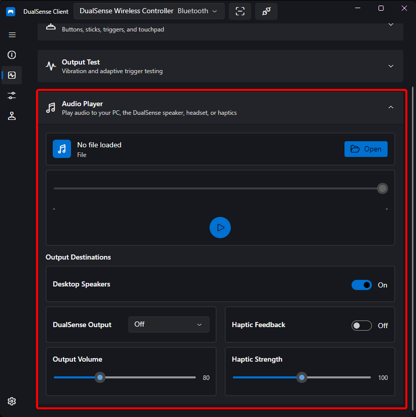

# Audio Playback

DualSense Client can play audio files to three independent destinations:

1. **Desktop speakers** — your normal system output
2. **DualSense speaker** — the small speaker built into the controller
3. **Controller haptics** — audio rendered as haptic feedback inside the grips

Each destination is controlled independently, so you can send one file to the speaker while another plays through the haptics.

## How It Works

- **Haptic audio over Bluetooth** is Opus-encoded specifically for the controller's haptic channels
- **USB audio** uses the controller's standard audio endpoint

## Controls

- **File** — open an audio file (mp3, wav, flac, …) via the **Open** button. The file name, duration, position, and a seek bar with play/pause are shown in the transport row.
- **Outputs**
    - **Desktop Speakers** toggle — when on, audio plays through the PC.
    - **Controller output** selector — `Off`, `Speaker` (controller's built-in speaker), or `Headset` (headset jack). Speaker and headset are mutually exclusive and cannot run at the same time.
    - **Haptic Feedback** toggle — when on, the audio also drives the haptic actuators.
- **Speaker Volume** — 0 – 255 for the controller speaker/headset path.
- **Haptic Strength** — 0 – 200% for the vibration intensity when haptics are enabled.

The same player is embedded in the [Input Monitor](input-monitor.md) output test section, so you can audition audio without leaving that page.

!!! note
    Haptic playback works best with sound effects and music with strong bass — the haptics are essentially two high-quality actuators, one per grip. The controller outputs are only usable when a controller is connected.

