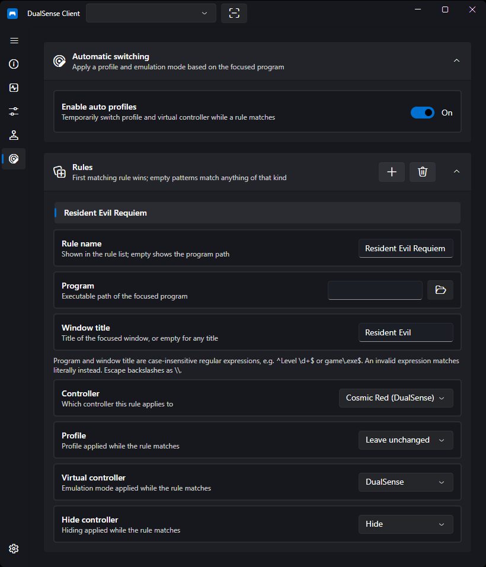

# Auto Profiles

Auto Profiles switch your controller's **profile**, **virtual controller mode**, and **hiding** automatically based on which program is focused. For example: a calm blue profile with no emulation on the desktop, and a game profile with Xbox 360 emulation when your game is in focus.

!!! note
    Auto Profiles need Windows focus tracking and are **Windows-only**. The page is hidden on other platforms.

## How It Works

Rules are evaluated **top-down, first match wins**, about once per second against the focused program. When a rule matches, its profile, emulation mode, and hiding are applied **temporarily** — your stored per-controller bindings are never modified. When no rule matches (or Auto Profiles are disabled), each controller falls back to its bound profile and stored emulation settings, and the hidden state from before the rule is restored.

A desktop notification is shown whenever the applied profile changes. Like other notifications, it follows the global notification toggle in Settings.

## Creating a Rule

1. Open the **Auto Profiles** page and press **+** to add a rule
2. Give it a **name** (optional — the program path is shown when empty)
3. Pick the **program** with the file picker (or type the path manually)
4. Optionally set a **window title** filter, **controller** target, **profile**, **virtual controller** mode, and **hiding**
5. Each dropdown starts at **"leave unchanged" / "All controllers"**, so a rule can switch any combination of profile, virtual controller, and hiding. A rule that leaves all three unchanged does nothing (the page says so). The hiding option is only shown when the [HidHide driver](controller-hiding.md) is available.

## Matching

A rule matches when the focused program satisfies **both** the program and the title filter (an empty filter matches anything). Both are **case-insensitive regular expressions** (search semantics):

| Example                | Matches                              |
| ---------------------- | ------------------------------------ |
| `game\.exe$`           | Any path ending in `game.exe`        |
| `^C:\\Games\\`         | Anything under `C:\Games\`           |
| `Main Menu\|Pause Menu` | Either title anywhere               |
| `^Level \d+$`          | Exactly `Level` followed by a number |

An invalid expression falls back to a plain contains match instead of breaking the rule. Note that backslashes are regex escapes: escape them (`\\`) for precise paths — a raw picked path with single backslashes is usually not a valid expression and simply matches literally.

New to regular expressions? Test your patterns live on [regex101.com](https://regex101.com/) (.NET flavor), and see the [MDN regular expressions guide](https://developer.mozilla.org/en-US/docs/Web/JavaScript/Guide/Regular_expressions) and [cheatsheet](https://developer.mozilla.org/en-US/docs/Web/JavaScript/Guide/Regular_expressions/Cheatsheet) — the syntax is the same apart from minor flavor details.

!!! tip
    Hover a rule in the list to see the full program path and title it matches.

!!! note
    Store/UWP apps (e.g. games installed via the Xbox app) all run behind `ApplicationFrameHost.exe`, so they cannot be told apart by program — use the window title filter for those.

## Per-Controller Rules

By default a rule targets **all controllers**. Pick a specific controller to give each pad its own setup per program — for example, player one's pad gets the game profile while player two's stays on default. Controllers are identified by MAC address with a device-path fallback, the same as [profile bindings](profiles.md#binding-profiles-to-controllers).
