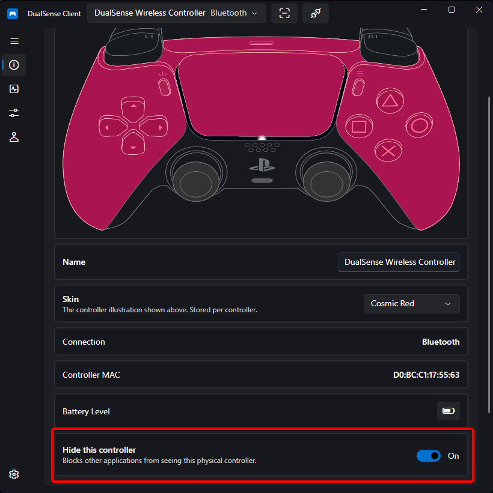

# Controller Hiding

When you use [virtual controller emulation](virtual-controller.md), games may see **two** controllers — the real one and the emulated one — causing double inputs in menus and gameplay. Controller Hiding solves this by making the physical controller invisible to other applications while DualSense Client keeps full access to it.

## Requirements

- **Windows only** — requires the [HidHide](https://github.com/nefarius/HidHide) driver
- Download and install HidHide once; no extra configuration needed in its own UI

## How It Works

- Each controller has its own **hide toggle** on its device page
- When hidden, games and other applications no longer receive input from the physical controller
- The app **whitelists itself** automatically, so monitoring, lighting, profiles, and everything else keep working against the hidden controller

## Typical Setup for Games

1. Install [HidHide](https://github.com/nefarius/HidHide) (once)
2. Enable [virtual controller emulation](virtual-controller.md) with your preferred controller type
3. Enable the hide toggle for the physical controller
4. Launch your game — it now sees only the virtual controller, with rumble and trigger feedback still reaching your hands

!!! tip
    If a game misbehaves after hiding (for example it cannot see the controller at all), toggle the hide switch off again first — then check that the game is reading the virtual device rather than the physical one.

