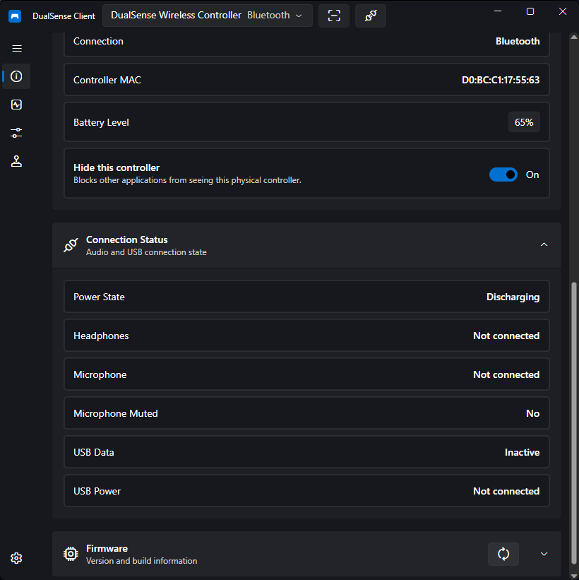

# Device Information

The Device Information page shows everything the controller reports about itself. Select the active controller from the title-bar picker — all sections on this page reflect that controller.

## Controller Identification

- **Controller illustration** — a skin-tinted visualization of the connected controller.
- **Name** — rename the selected controller. The name is stored per controller and used in the title-bar picker, tray menu, and notifications.
- **Skin** — choose the illustration skin used for the visualization above. Skins are stored per controller.
- **Connection** — the current transport: USB or Bluetooth.
- **Controller MAC** — the Bluetooth MAC address (or HID path as a fallback identifier).

## Battery

- Current **battery level** (percentage when known)
- **Power state**, such as charging or discharging

A toggle lets you switch between the percentage text and a battery icon. The tray icon can also show the active controller's battery — see [Settings](settings.md#window-tray).

## Firmware & Hardware

Use the **Refresh** button in the header to re-read all values from the controller:

- **Firmware versions** — main, SBL, DSP, and MCU/Spider DSP
- **Model revision**, hardware version, and hardware generation
- **Build date** and **Build time** of the installed firmware

## Connection Status

Live status indicators show whether:

- Headphones are plugged into the controller's jack
- A microphone is plugged in
- The microphone is muted
- USB carries data and/or power only

---

The Device page also exposes per-controller actions — the [controller hiding](controller-hiding.md) toggle and [virtual controller](virtual-controller.md) emulation — and the title-bar Scan/Disconnect controls described in [Settings](settings.md#other-window-controls).

