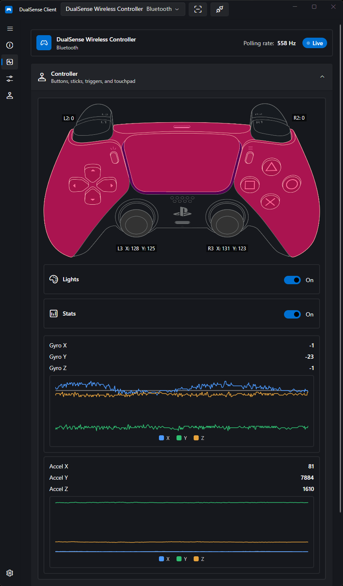

# Input Monitor

The Input Monitor page shows a live view of everything your controller reports, updated in real time.

## What Is Monitored

- **Buttons** — every button on the controller
- **Sticks** — both analog stick positions
- **Triggers** — L2/R2 analog values
- **Motion sensors** — live gyro and accelerometer graphs
- **Touchpad** — touch positions and clicks

## Live Status & Connection

A status strip at the top of the page shows the controller name and type, the current **polling rate** (Hz), and a pulsing **Live** badge when reports are arriving (or **Waiting** otherwise). The current **connection type** (USB or Bluetooth) is detected automatically.

With several controllers connected at once, use the **controller picker** in the title bar to switch which device you are monitoring.

## Visualization

- A skin-tinted controller view reflects the live input.
- **Edge paddles and Fn buttons** — on a DualSense Edge, indicators for FnL, FnR, L4, and R4 light when pressed.
- Toggles let you show/hide the **lightbar LEDs** and the **statistics/motion graphs**.

## Motion

When statistics are shown, two live graphs display:

- **Gyroscope** — X, Y, Z
- **Accelerometer** — X, Y, Z

## Output Test

Below the visualization, an **Output Test** section lets you exercise the motors without launching a game:

- **Vibration** — independent enable toggles and 0 – 255 strength sliders for the left and right motors.
- **Adaptive triggers** — per-trigger (L2/R2) effect modes and parameters; see [Rumble & Triggers](rumble-and-triggers.md) for the mode table and slider ranges (Force 0 – 255, Frequency 0 – 15, Start/End).

## Audio Player

The **Audio Player** at the bottom is the same player documented in [Audio Playback](audio.md): open a file, use the transport bar, and choose desktop speakers vs. controller outputs. Note that speaker and headset cannot run at the same time as controller outputs — the output selector enforces this.

!!! tip
    The input monitor is handy for diagnosing stick drift, verifying trigger travel, or just confirming button prompts map correctly in games.

