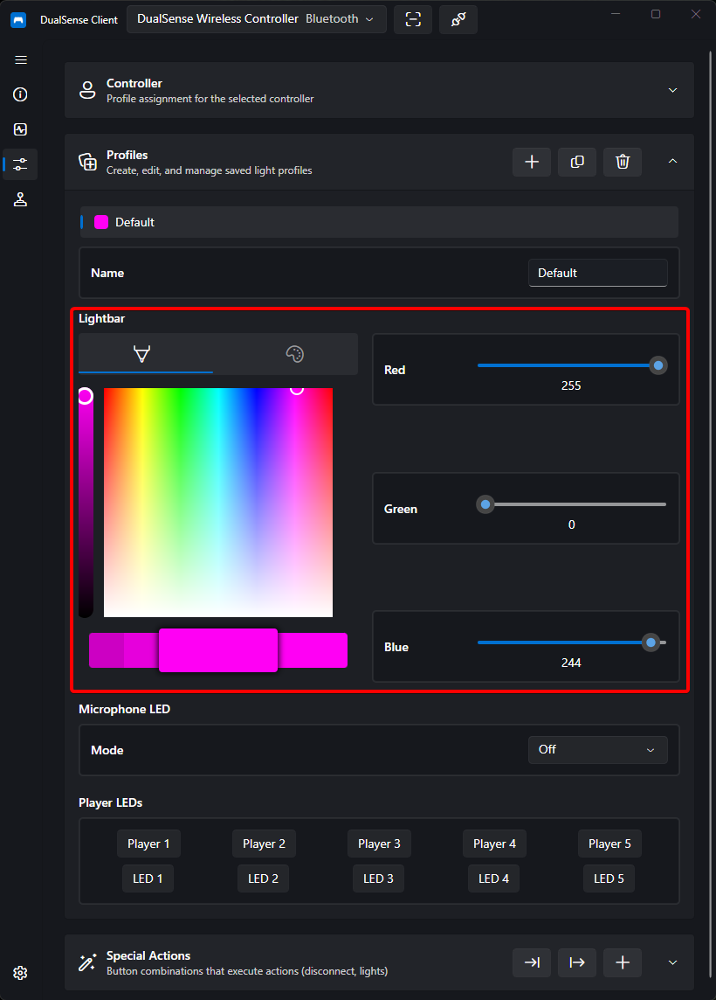
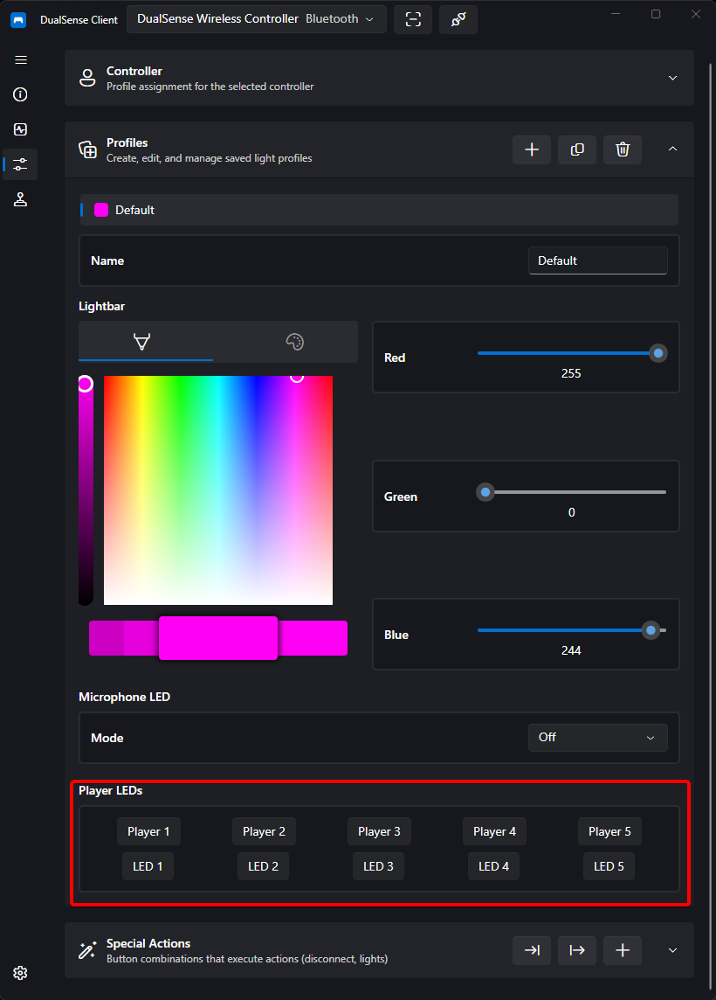

# Light Control

DualSense Client gives you full control over the controller's lighting: the RGB lightbar, the five player LEDs, and the microphone LED.

## Lightbar

The lightbar supports full RGB color control:

- **Color picker** — pick any color visually
- **Sliders** — fine-tune individual color channels
- **Presets** — quick one-click colors
- **Reset** — restore the controller's default lighting

!!! tip
    Once you have a look you like, save it as a [profile](profiles.md) so it is applied automatically whenever that controller connects.

## Player LEDs

Toggle each of the five player indicator LEDs individually. This is the same set of lights used on the PS5 to show player slots (1–4 plus the extra LED).

!!! note "Depends on controller generation"
    The available controls depend on the connected controller's hardware generation (see [Firmware & Hardware](device-info.md#firmware-hardware)):

    - **Generation 0x02 / 0x03** — full support. The profile shows both the five player presets (**Player 1 – 5**) and five individual toggles (**LED 1 – 5**).
    - **Generation 0x04** — **mirrored only**. Only the five presets are offered; the individual LED toggles are hidden. You can verify the generation on the Device Information page.
    - When no controller is connected or its firmware info is not yet valid, the view falls back to presets only.

## Microphone LED

Configure how the microphone LED behaves:

| Mode  | Behavior                        |
| ----- | ------------------------------- |
| Off   | The mic LED stays off           |
| On    | The mic LED stays lit           |
| Pulse | The mic LED pulses continuously |

---

Changes are applied to the controller immediately. To keep them between sessions, bind them to a [profile](profiles.md).

