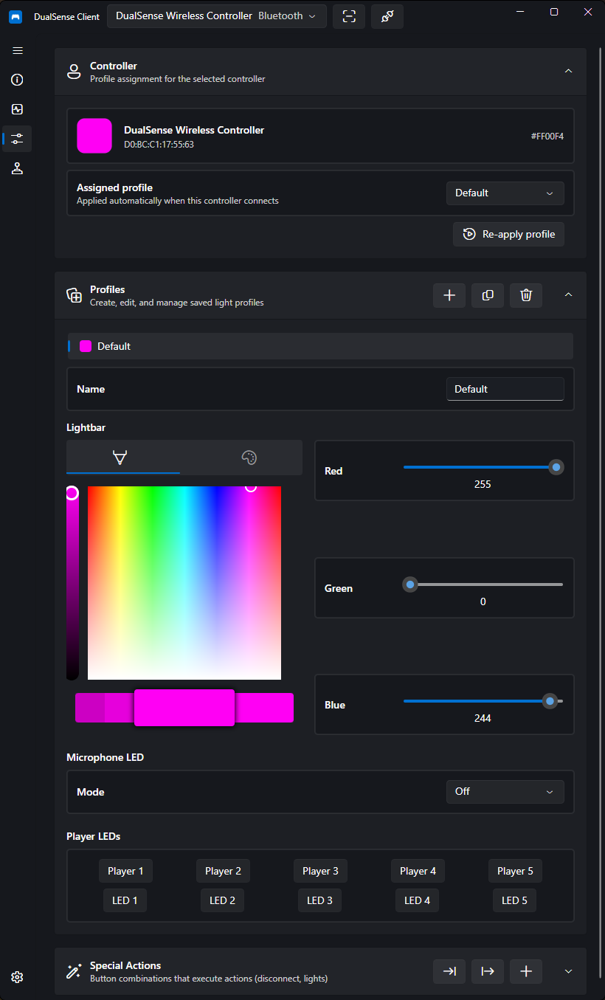

# Profiles

Profiles store your controller's settings and can be bound to specific controllers, so your setup is applied automatically every time a controller connects.

## Creating a Profile

Create profiles from the Profiles page. You can:

- **Create** a new profile from scratch
- **Duplicate** an existing profile to use as a starting point
- **Rename** and **delete** profiles at any time
- **Save the selected controller's current light state** as a profile — set up your [lighting](light-control.md) exactly how you want it, then capture it

## Binding Profiles to Controllers

Each profile can be bound to a specific controller by **MAC address** (with a device path fallback if the MAC is unavailable).

When a bound controller connects, its profile is **applied automatically**. You can also reapply the active profile manually at any time.

!!! tip
    Binding by MAC address means you can own multiple controllers with different lighting setups — for example one per player — and each gets its own look the moment it connects.

