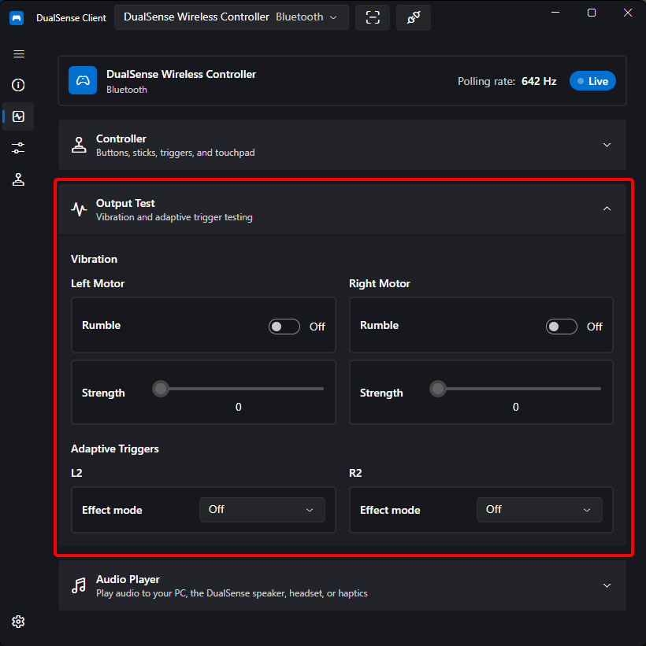

# Rumble & Triggers

Test and configure the controller's output motors: the rumble motors and the adaptive triggers for L2/R2.

## Rumble Test

Send a rumble test with independent strength control for each motor:

- **Left motor** — low-frequency, heavier rumble
- **Right motor** — high-frequency, lighter rumble

Adjust each slider to feel how your controller responds at different strengths.

## Adaptive Triggers

The L2/R2 triggers support several effect modes:

| Mode       | Behavior                                                 |
| ---------- | -------------------------------------------------------- |
| Resistance | Constant resistance while pulling the trigger            |
| Trigger    | Resistance that engages from a defined point in the pull |
| Automatic  | Effect patterns played by supported games/software       |

Each mode exposes adjustments for:

- **Force** — how strong the effect feels
- **Frequency** — for oscillating effects
- **Start** — where in the trigger travel the effect begins
- **End** — where the effect stops

