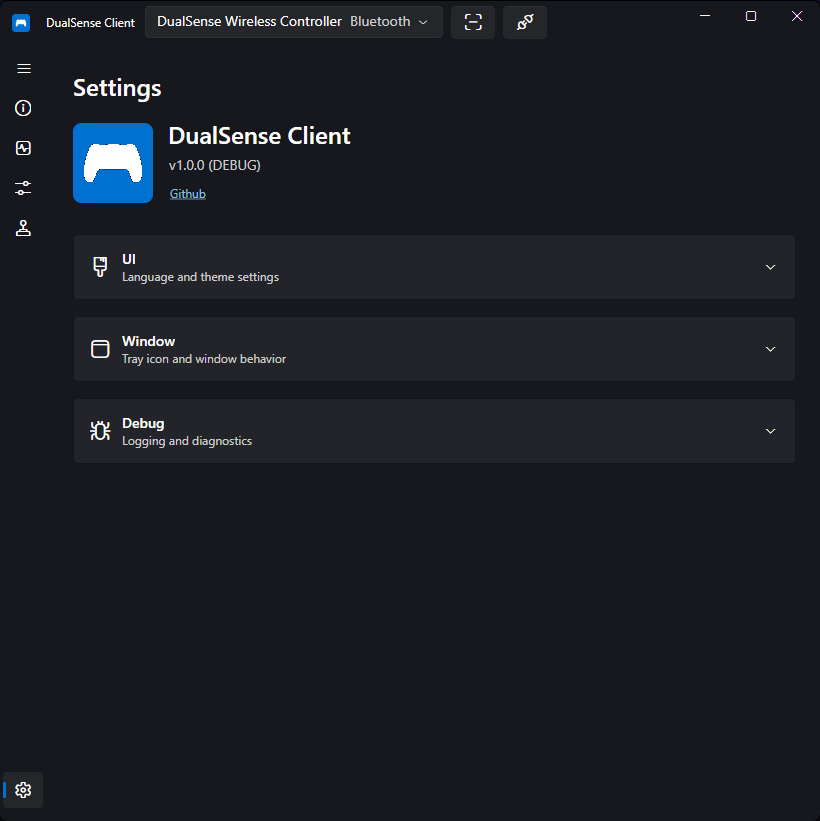
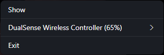
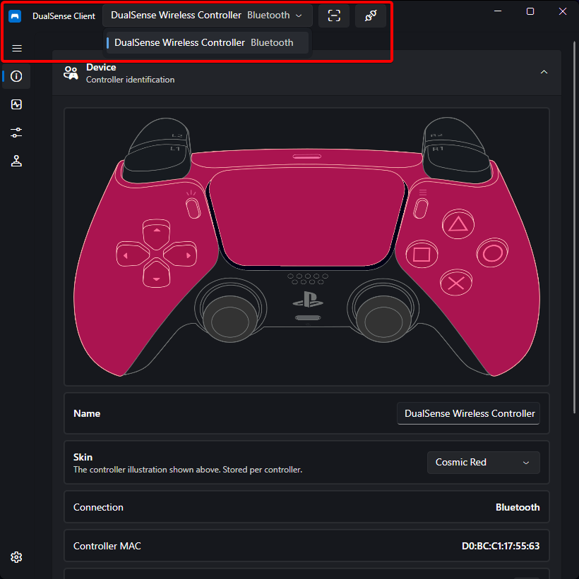

# Settings

The **Settings** page controls the application's appearance, window behavior, and diagnostics. You can also access many of these options from the system tray without opening the main window.

## Appearance

### Theme

| Theme | Description |
| ----- | ----------- |
| System | Follows the operating system's light/dark preference. |
| Light | Light backgrounds with dark text. |
| Dark | Dark backgrounds with light text. |
| Amoled | True-black backgrounds that switch off pixels on OLED displays. |
| Playstation | Deep blue-tinted surfaces with a PlayStation-blue accent, inspired by the PS5 home screen. |

The selected theme is applied immediately and persisted. Only the themes listed above are available — see [Creating Custom Themes](https://github.com/DualSenseClient/DualSenseClient/blob/main/docs/CONTRIBUTING.md#creating-custom-themes) if you want to build one.

### Language

Choose the display language from the dropdown. The app currently ships in English; additional translations can be contributed — see [Translating](https://github.com/DualSenseClient/DualSenseClient/blob/main/docs/CONTRIBUTING.md#translating).

## Window & Tray

The app provides a system tray icon so it can run in the background.

| Setting | What it does |
| ------- | ------------ |
| **Close to tray** | Closing the window hides it to the tray instead of quitting. Reopen it from the tray menu. |
| **Start in tray** | Launch the app already hidden to the tray. |
| **Show battery percentage on tray icon** | When enabled, the tray icon shows the active controller's battery as plain numbers. When disabled (or no controller has a known battery level), the app icon is shown instead, tinted with the current theme's accent color. |

### Tray Icon Menu

- **Show** — restores the main window.
- **Per-controller submenu** — each connected controller appears with its display name and battery percentage. Inside you can:
    - **Select** the active controller (radio item).
    - **Profiles** — switch the controller's bound profile.
    - **Emulation** — switch the virtual controller mode (disabled while a virtual device is being created).
    - **Disconnect** — Bluetooth-only: disconnects the controller.
- When no controllers are connected, a disabled *No controllers connected* item is shown.
- **Exit** — quits the application.

!!! tip
    You can change profiles and virtual controller modes entirely from the tray, without opening the main window — useful during a game.

## Diagnostics

### Log Level

Choose the minimum logging verbosity:

`Trace` → `Debug` → `Info` → `Warning` → `Error` → `Critical` → `None`

- The default is `Info`.
- Raising verbosity (e.g. to `Debug`) is useful when reporting a problem — see [Logs](../troubleshooting.md#logs) for where log files are stored.
- Changes apply immediately at runtime.

## Other Window Controls

Outside the Settings page, the title bar also exposes:

- A **controller picker** dropdown (connected controllers with their name and connection type — Bluetooth/USB) for switching which device the pages act on.
- A **Scan** toggle that starts/stops HID scanning for newly connected controllers.
- A **Disconnect** button (visible only for Bluetooth controllers) that disconnects the selected controller.

Notifications for connect, disconnect, and profile actions appear as slide-in banners at the bottom of the window; action banners offer a button that runs the action and clears the queue.

