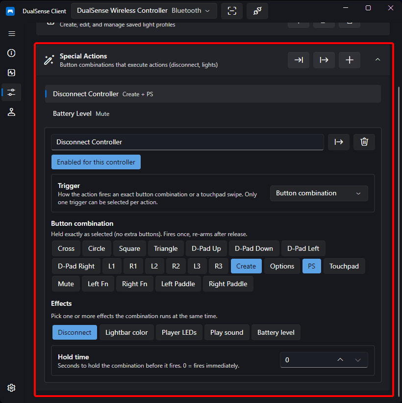
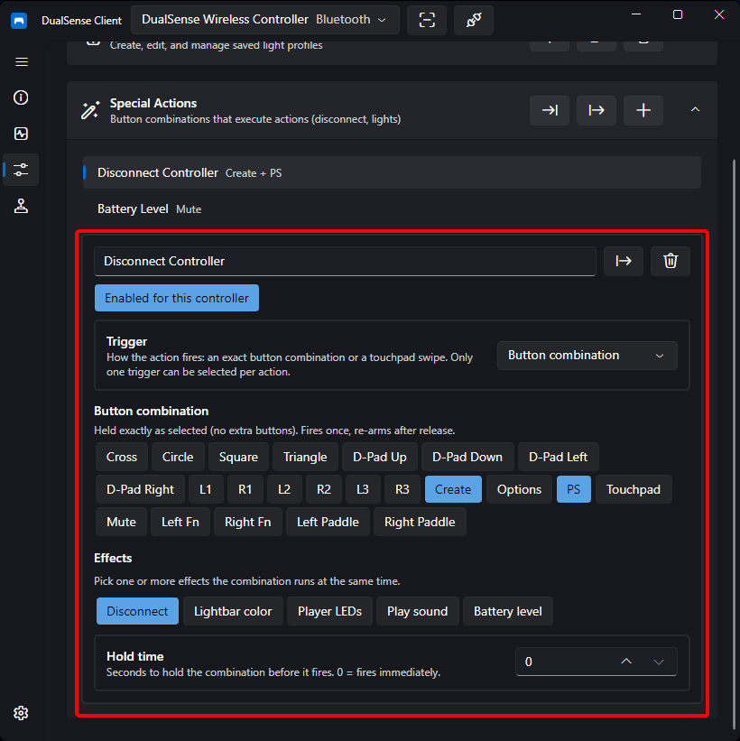

# Special Actions

Special Actions let you trigger custom effects by holding a **button combination** or swiping on the **touchpad**. Each action lives on the Profile page, is bound to specific controllers, and can do things like disconnect the controller, change lights, play a sound, or show the battery level.

## Where to Find Them

Open the **Profile** page and scroll to the **Special Actions** section. All actions are global — you create them once and then enable them per-controller.

## Creating an Action

1. Press **New** in the Special Actions header to create an action.
2. Give it a name.
3. Toggle **Enabled for this controller** to enable it for the currently selected controller. An action with no enabled controllers is defined but never fires.
4. Configure the trigger and effects described below.

Use **Import** / **Export** to share whole collections, or export a single action from its row. Imported actions arrive disabled — enable them for the controllers you want.

## Trigger

Each action has exactly one trigger:

| Trigger | Description |
| ------- | ----------- |
| **Button combination** | Hold one or more buttons simultaneously. The combination must match exactly — holding an extra button blocks it. It fires once and re-arms when you release the buttons. |
| **Touchpad gesture** | Swipe a single finger across the touchpad in one of four directions: **Swipe Up**, **Swipe Down**, **Swipe Left**, **Swipe Right**. When a gesture is set, the button combination is ignored. |

## Timing

| Setting | Range | Description |
| ------- | ----- | ----------- |
| **Hold time** | 0 – 10 s | How long the exact combination (or swipe) must be held before the action fires. `0` fires immediately. |
| **Apply while held** | on/off | When enabled, light effects revert and sound stops as soon as you release the trigger, instead of staying applied. |
| **Duration** | 0 – 60 s | How long light effects stay applied before the bound profile is restored automatically. `0` keeps them applied. Ignored for Disconnect/Sound and when *Apply while held* is on. |

## Effects

An action can carry several effects at once, at most one per type. Pick the ones you need:

| Effect | What it does |
| ------ | ------------ |
| **Disconnect** | Disconnects the controller over Bluetooth. |
| **Set lightbar color** | Sets the lightbar to a chosen RGB color. Uses the color picker or Red/Green/Blue sliders. |
| **Set player LEDs** | Sets the player LED layout — either a preset (Player 1 – 5) or individual LED 1 – 5 toggles. On hardware generations that do not report full LED support, only mirrored presets are available. |
| **Play sound** | Plays an audio file (mp3, wav, flac, …) through the controller's **Speaker** or a **Headset** plugged into the controller jack. Configurable volume (0 – 255), and optional haptic feedback with strength (0 – 200%). |
| **Show battery level** | Sets the lightbar to a color that represents the current battery charge in 10 levels (level 0 = lowest, 9 = full). Pick a color per level; missing entries fall back to the default gradient from red (low) through orange/yellow to green (full). Not combinable with other light-changing effects. |

!!! note
    Disabling an individual effect keeps it in the list with its parameters — toggling it back on restores them without re-entering values.

!!! warning
    The **Show battery level** effect cannot be combined with other light-changing effects on the same action.

## Tips

- Use a lightbar + player-LED action to give yourself a visual mode indicator (e.g. a red lightbar for a "stealth" profile).
- Use a short sound action as a confirmation beep when you press a combo that changes lights.
- Export your actions before reinstalling or resetting settings — the whole collection lives in a single settings file.
