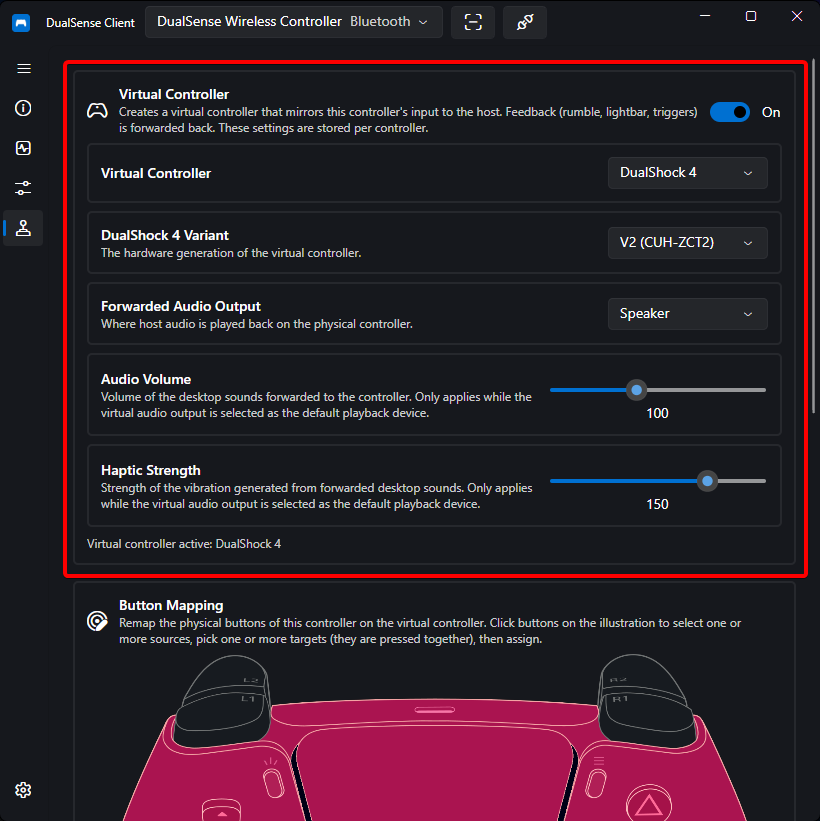
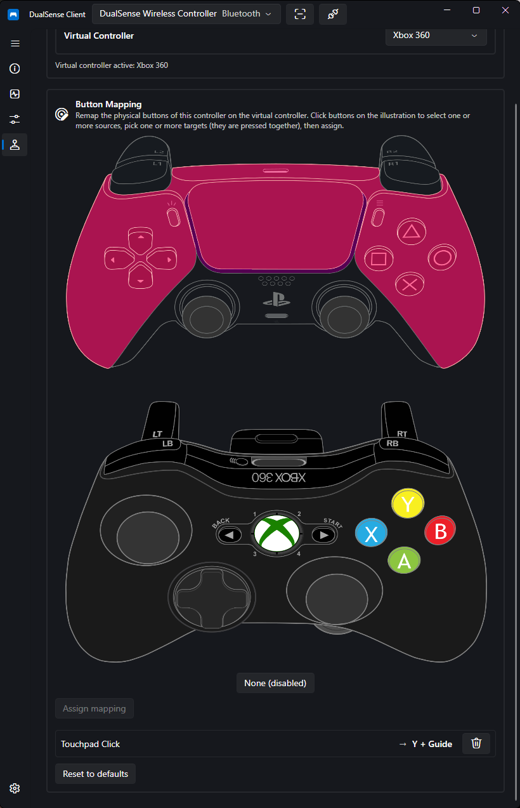
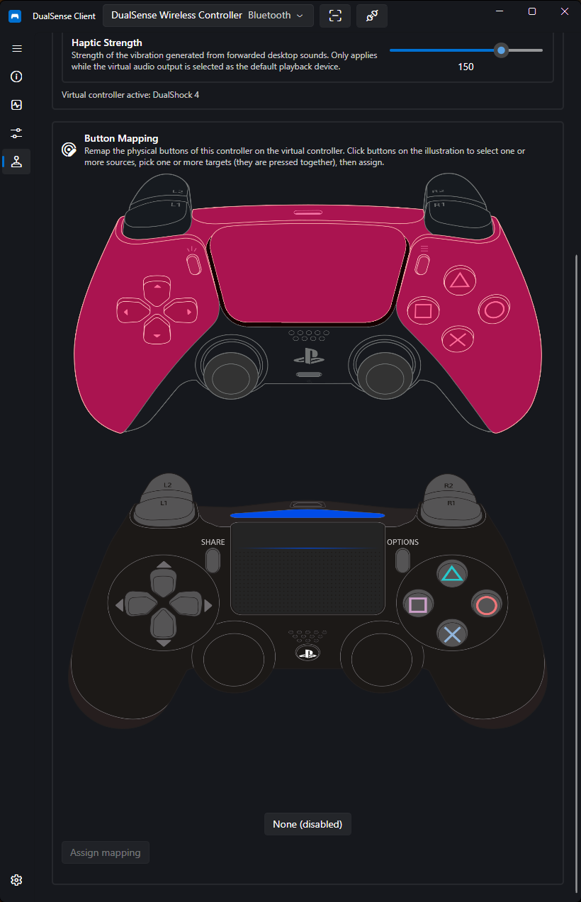
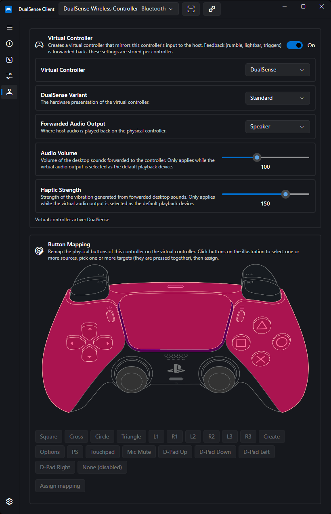

# Virtual Controller

DualSense Client can create a **virtual controller** that mirrors your physical DualSense, letting games see whichever controller type they handle best.

## Emulated Controller Types

| Type                         | Notes                                                |
| ---------------------------- | ---------------------------------------------------- |
| Xbox 360                     | The most widely supported type in PC games           |
| DualShock 4                  | Native PlayStation-style prompts in supporting games |
| DualSense (Standard or Edge) | Exposes haptics and adaptive triggers to the host    |

The virtual device **mirrors the physical controller's input**, while rumble, lightbar, and trigger feedback from the host is **forwarded back** to your physical controller.

## Requirements

libVIIPER — the emulation backend — is bundled with the app. You only need the **USB/IP driver** so virtual devices can attach to the system:

=== "Windows"

    Install [usbip-win2](https://github.com/vadimgrn/usbip-win2)

=== "Linux"

    Install `usbip`:

    ```bash
    # Arch
    sudo pacman -S usbip

    # Ubuntu/Debian
    sudo apt install linux-tools-generic
    ```

If no virtual device appears after enabling emulation, see [Virtual Controller Does Not Appear](../troubleshooting.md#virtual-controller-does-not-appear).

## Enabling & Configuring

1. Connect your physical controller
2. Open its device page (or the tray menu) and enable emulation with your preferred controller type
3. Settings are applied per controller automatically on connection



## Button Remapping

Each emulation mode has its own **mapping editor** where you can rewire physical buttons to different virtual outputs.

1. **Select source buttons** — click buttons on the illustrated controller. On a DualSense Edge you can also select the Edge chip buttons (FnL, FnR, L4, R4). Select several at once to create a combo; the summary shows what is selected and a **Clear** button resets it.
2. **Choose the target** — depending on the emulated controller:
    - **Xbox 360 / DualShock 4** — pick targets on the virtual-controller illustration (click to toggle). The kind of illustration follows the emulated type.
    - **DualSense** — pick targets from the combo list (multiple targets can be pressed together). **None (disabled)** creates a disabled binding that suppresses the source.
3. **Trigger output** — when a single L2 or R2 is the only source button, choose between **Full pull (analog 0 – 255)** and **Click flag only** (digital click) for the virtual trigger. Only available for DualShock 4 and DualSense emulation.
4. **Suppress solos** — when a combo is mapped, the solo presses of those buttons are muted while the combo is held. Uncheck to allow solos through.
5. Press **Assign** to save the binding. If the same source keys already have a binding, it is replaced. Each row shows the source → target summary with a **Delete** button.

Other mapping actions:

- The **bindings list** shows every rule; remove any with its delete button.
- **Reset to defaults** clears all custom bindings for the current emulation mode.

=== "Xbox 360"

    

=== "DualShock 4"

    

=== "DualSense"

    

If no mapping is desired, leave the editor empty — the default one-to-one mapping applies.

## Host Audio Forwarding

When emulating a DualSense, the virtual device exposes audio interfaces to the host: game audio can be forwarded to your **physical controller's speaker or headset**, with volume and haptic-strength controls.

Available under the emulation options as **Forwarded Audio Output** (Speaker vs. Headset), **Audio Volume** (0 – 255), and **Forward Haptics** (0 – 200).

!!! note
    Forwarded-audio sliders apply to desktop sounds routed through the app.

## Status & Combining With Games

The **Emulation status** text shows the lifecycle: `Idle`, `Creating…`, or `Virtual controller active: {mode}` (with the Edge variant noted when applicable). The enable toggle is disabled while a virtual device is being created or when emulation is unsupported on the platform.

Games that would otherwise react to _both_ the physical and virtual controllers can be fixed by hiding the physical device — see [Controller Hiding](controller-hiding.md).

