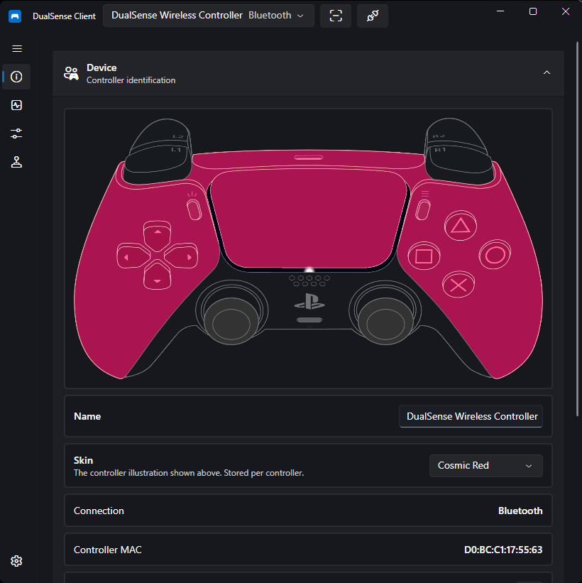

# DualSense Client

**DualSense Client** is an open-source management tool for the **PlayStation 5 DualSense Controller** on Windows and Linux. It provides lightbar and LED control, profile management, real-time input monitoring, rumble and adaptive trigger output, and audio playback to the controller's speaker and haptics.

It can also create virtual controllers (Xbox 360, DualShock 4, or DualSense) through the embedded libVIIPER backend, and hide physical controllers from other applications via HidHide.

Built with .NET and Avalonia, it connects over USB or Bluetooth through HIDAPI (provided by SDL3) with no drivers required.

---

## Supported Controllers

| Controller            | Supported | Notes                                                     |
| --------------------- | :-------: | --------------------------------------------------------- |
| DualSense (USB)       |    ✅     | Full support                                              |
| DualSense (Bluetooth) |    ✅     | Full support including speaker and haptics audio          |
| DualSense Edge        |    ✅     | Full support including Fn buttons and paddles1 |

1. Implemented but not yet verified on real hardware — no Edge device was available during development.

---

## Features

- :material-battery:{ .lg .middle } **Device Information**

    ***

    Battery level, firmware versions, and connection status at a glance.

    [:material-arrow-right: Device Information](guides/device-info.md)

- :material-gamepad-variant:{ .lg .middle } **Input Monitor**

    ***

    Live view of every button, stick, trigger, motion sensor, and touchpad input.

    [:material-arrow-right: Input Monitor](guides/input-monitor.md)

- :material-vibrate:{ .lg .middle } **Rumble & Triggers**

    ***

    Test motors and configure adaptive trigger effects for L2/R2.

    [:material-arrow-right: Rumble & Triggers](guides/rumble-and-triggers.md)

- :material-music-note:{ .lg .middle } **Audio**

    ***

    Play audio to your desktop, the DualSense speaker, or the haptics.

    [:material-arrow-right: Audio Playback](guides/audio.md)

- :material-lightbulb-on:{ .lg .middle } **Light Control**

    ***

    Full RGB lightbar control, player LEDs, and microphone LED modes.

    [:material-arrow-right: Light Control](guides/light-control.md)

- :material-account-cog:{ .lg .middle } **Profiles**

    ***

    Create, bind, and automatically apply lighting profiles per controller.

    [:material-arrow-right: Profiles](guides/profiles.md)

- :material-gesture-tap-button:{ .lg .middle } **Special Actions**

    ***

    Button combos and touchpad swipes that disconnect, light up, or play sounds.

    [:material-arrow-right: Special Actions](guides/special-actions.md)

- :material-controller-classic:{ .lg .middle } **Virtual Controller**

    ***

    Emulate an Xbox 360, DualShock 4, or DualSense controller for games.

    [:material-arrow-right: Virtual Controller](guides/virtual-controller.md)

- :material-eye-off:{ .lg .middle } **Controller Hiding**

    ***

    Hide the physical controller from games to prevent double input.

    [:material-arrow-right: Controller Hiding](guides/controller-hiding.md)

- :material-cog:{ .lg .middle } **Settings & Tray**

    ***

    Themes, language, tray icon, and diagnostics in one place.

    [:material-arrow-right: Settings](guides/settings.md)

---

## Quick Links

- New here? Start with the [Installation guide](installation.md).
- Looking for a specific setting? Browse the [Guides](guides/light-control.md).
- Something not working? Check [Troubleshooting](troubleshooting.md) and the [FAQ](faq.md).

---

## Disclaimer

> This project is not affiliated with or endorsed by **Sony Interactive Entertainment**.
> "PlayStation", "DualSense", and related marks are trademarks of their respective owners.

